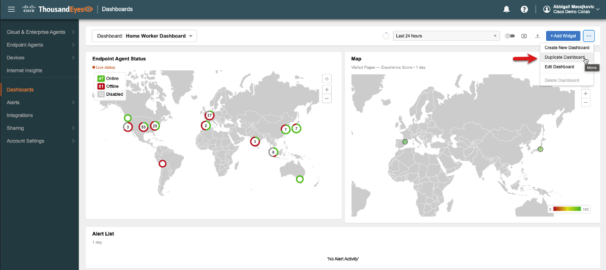
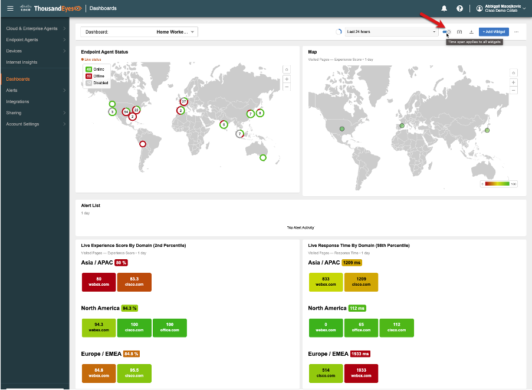

# ThousandEyes Home Worker Dashboard (optional)

Dashboards provie a rich powerful way to visualize your ThousandEyes tests, quickly isolate issues, and see the health of your infrastructure and applications.
Since we are focused on the Endpoint Agent we will use a dashboard that is based off this blog: [Best Practcies to Create a "Remote Workforce" Dashboard](https://www.thousandeyes.com/blog/best-practices-create-remote-workforce-dashboard).

Navigate to **Dashboards**. Use the pull down to select the **Home Worker Dashboard** then select the **“…”** pull down to duplicate the dashboard.
Name it your name-Roadshow Home Worker Dashboard as this will allow you to try out some of the widgets without effecting the original.

Test out the pull down for time and use the toggle to update all widgets. The snapshot feature will create a link for the dashboard. Additonally it can be scheduled to be emailed to team members or executives who may use for reports or meetings. Lastly the download options can create a pdf or csv file.

Each widget can be customized, or new widgets can be added based on your reporting requirements. Dashboards can be created to show Wi-Fi health of home vs. office, floor or building using the SSID or BSSID and labels. This makes it so your dashboard will be dynamic based on the time and how users are accessing the network and applications.

We'll use CPU color grid widget for this example. Click on the **settings** icon in the top right and click **Configuration** to see the Editing Color Grid pop out.

Changing the **Data Source** allows for different categories and Endpoint Agent metrics to be displayed in the widget. You can use the **"..."** to duplicate or delete the widget. Adjusting the **DESIGN** section will change the way the cards show up. The **Drill Down** is a great way to provide a filter for the metrics. For example if you were looking at **Visited Pages** for a category you could use it to filter down to the critical domain(s) you want the widget to display.

Feel free to modify, add widgets and make changes to your dashbord. Have fun with it and if you want to learn more about ThousandEyes dashboards check out our [Getting Stared with Dashboards](https://docs.thousandeyes.com/product-documentation/getting-started/getting-started-with-dashboards) documenation.

Outside of the scope of this but a best practice recommendation is to set up alert rules with suitable conditions and assign those to your tests associated with your Endpoint Agents. This ensures you are notified of potential issues as soon as they occur, allowing for a swift resolution before user impact. For instance, if an Endpoint Agent detects a network connection issue, it can send an alert to your IT team. They can then investigate and resolve the issue before it starts affecting users. Alert rules can be configured to monitor performance metrics such as latency, packet loss, and jitter, or to flag when an application becomes unavailable or experiences degraded performance.

You can choose to receive these alerts when certain thresholds are exceeded and have them directed to a tool of your preference. ThousandEyes supports numerous integration options, including native integrations with Webex and ITSM tools such as ServiceNow and PagerDuty. Alternatively, you can choose from various custom webhook templates such as Webex, Slack, Microsoft Teams, or any third-party tool of your choice using the generic template. ThousandEyes integrations are powerful, delivering alerts directly into your existing workflow, thereby centralizing data and notifications from multiple sources into a single platform. For more information check out [Getting Started with Alerts](https://docs.thousandeyes.com/product-documentation/getting-started/getting-started-with-alerts).

You've done an amazing job learning about how to deploy, configure and use the ThousandEyes Enpoint Agent to help you solve and isolate your end users issues providing you with actionable data and reducing your mean time to resolution (MTTR). Continue on to [Logging Out and Ending the Lab Session](./Task8.md)